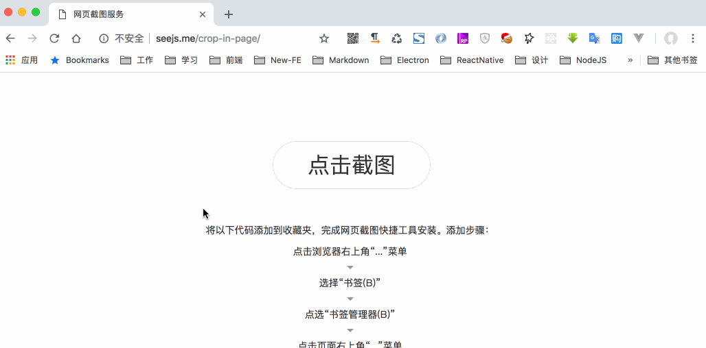

## 网页截图插件

配合Puppeteer完成网页截图，[在线示例](http://seejs.me/crop-in-page/)。

### 预览


### 使用方法

* ES6 Module
```js
import CropInPage from 'crop-in-page';

const cropper = new CropInPage();
cropper.init(); // 即可打开截图界面
```

* AMD Module
```js
const CropInPage = require('crop-in-page').default;

const cropper = new CropInPage();
cropper.init();
```

* Online url
```xml
<script src="${script_path}/crop-in-page/dist/index.min.js"></script>
<script>
(() => {
    const Component = CropInPage.default;
    const cropper = new Component();
    cropper.init();
})();
</script>
```

### 功能列表
- [x] 整页截图
- [x] 全屏截图
- [x] 选区截图
